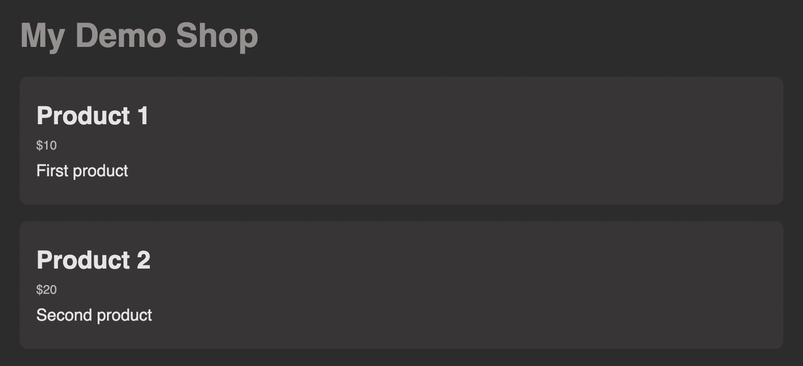

# Day 3 / 30 React Revision
---
### Coding Exercise 3: Working with JSX Code

This is a quick exercise to get started with React and JSX code: Your task is to edit the JSX code of a provided React component such that it displays a `h1` element with the text "`Exercise done!` on the page.

Important: The custom JSX code must be added inside the existing `<div>` element.

#### Excercise Code:
##### App.js
```
import React from 'react';

// don't change the Component name "App"
export default function App() {
    return (
        <div>
            <p>Practicing React...</p>
        </div>
    );
}
```

#### Excercise Practice:
##### App.js
```
import React from 'react';

// don't change the Component name "App"
export default function App() {
    return (
        <div>
            <h1>Exercise done!</h1>
            <p>Practicing React...</p>
        </div>
    );
}
```

### Coding Exercise 4: Building a First Component

Practice what you learned about components and **build a new React component on your own!**

Your task is to build a custom `<ExerciseComponent />` that outputs the text "`First exercise - done!`" on the screen.

Use the empty `ExerciseComponent.js` file for your new component code and output this component inside the already existing `App` component thereafter (replace the existing JSX code in App with your own component).

The final app should display this basic output:


*Important: If the built-in code editor shows an error related to your JSX code, you may ignore that - it's most likely a Udemy bug!*

*Also make sure you export your components like this:*

```
export default function SomeComponent() {
  // ...
}
```

Using this approach might fail (here in the Udemy code editor - normally, this would be absolutely valid code!):

```
function SomeComponent() {
  // ...
}
export default SomeComponent;
```

#### Excercise Code:
##### App.js
```
import React from 'react';

// don't change the Component name "App"
export default function App() {
    return <p>Todo: solve exercise</p>;
}
```

##### ExcerciseComponent.js
```
import React from 'react';
// Todo: Add your component code
// Important: Use export default function MyCmp() { ... }, don't define "export default" on a separate line!
```

#### Excercise Practice:
##### App.js
```
import React from 'react';
import ExerciseComponent from "./ExerciseComponent"

// don't change the Component name "App"
export default function App() {
    return <ExerciseComponent></ExerciseComponent>;
}
```

##### ExcerciseComponent.js
```
import React from 'react';
// Todo: Add your component code
// Important: Use export default function MyCmp() { ... }, don't define "export default" on a separate line!
function ExerciseComponent() {
    return <p>First exercise - done!</p>
}

export default ExerciseComponent;
```


### Coding Exercise 5: Passing Data via "props"
You're working on the UI prototype for an online shop and your task is to output **two product items** (via the `<Product />` component you find in the `Product.js` file) below the main page title ("`My Demo Shop`") in the App component.

The final UI should look like this:


The **two product items** should use the **same component** (`<Product />`) but output **different data** (`title`, `price` & `description`). Data should be passed to the components (and output there) via `props`.

The **first product item** is expected to display the following information:

- Title: `Product 1`
- Price: `10`
- Description: `First product`

The second product item is expected to display the following information:

- Title: `Product 2`
- Price: `20`
- Description: `Second product`

#### Excercise Code:
##### App.js
```
import React from 'react';

import Product from './Product';
import './styles.css';

// don't change the Component name "App"
export default function App() {
    return (
        <div>
            <h1>My Demo Shop</h1>
        </div>
    );
}
```
##### Product.js
```
import React from 'react';

export default function Product() {
    return (
        <article className="product">
            <h2>TITLE</h2>
            <p className="price">$PRICE</p>
            <p>DESCRIPTION</p>
        </article>
    );
}
```
##### style.css
```
body {
    font-family: sans-serif;
    margin: 0;
    padding: 3rem;
    background-color: #2d2c2c;
    color: #959090;
}

.product {
    margin: 1rem 0;
    padding: 1rem;
    background-color: #373535;
    color: #e7e4e4;
    border-radius: 8px;
}

.product h2,
.product p {
    margin: 0.5rem 0;
}

.price {
    font-size: 0.75rem;
    color: #bab6b6;
}
```

#### Excercise Practice:
##### App.js
```
import React from 'react';

import Product from './Product';
import './styles.css';

// don't change the Component name "App"
export default function App() {
    const products = [
        {
            title: "Product 1", 
            price: 10, 
            description: "First product"
        },
        {
            title: "Product 2", 
            price: 20, 
            description: "Second product"
        }]
    
    return (
        <div>
            <h1>My Demo Shop</h1>
            <Product 
            title={products[0].title}
            price={products[0].price} 
            description={products[0].description}
            >
            </Product>
            <Product
            title={products[1].title}
            price={products[1].price} 
            description={products[1].description}
            >
            </Product>
        </div>
    );
}
```

##### Product.js
```
import React from 'react';

export default function Product(props) {
    return (
        <article className="product">
            <h2>{props.title}</h2>
            <p className="price">${props.price}</p>
            <p>{props.description}</p>
        </article>
    );
}
```


## Complete Assignment 1

#### Following steps were implemented

- Create a new project
- Add a first custom component
- Adding JSX code
- Adding Basic CSS Styling
- Output Dynamic Data
- Pass Data via props
- Added normal JavaScript logic
- Split Components into multiple Components
  
Source Code - [Click Here](./code/assignment-1-solution/)

You also find [section slides](./slides/slides.pdf).