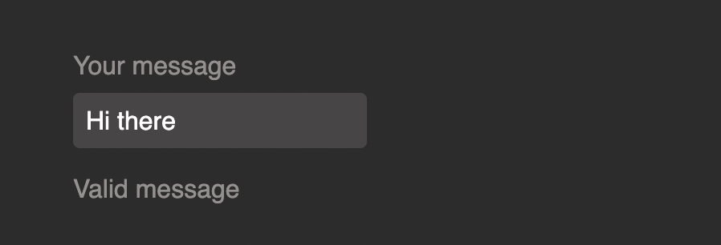

# Day 6 / 30 React Revision
--- 

### Coding Exercise 9: Using State with Form Inputs

You're working on a **text messaging app** and your task is to **validate** the text entered by a user whilst the user is typing.

If the text message entered is **valid** (for this example: if it's at least 3 characters long), the text `"Valid message"` should be displayed below the input field. If it's invalid (i.e., shorter than 3 characters), the text `"Invalid message"` should be displayed.

This image shows how the finished app should look like when an **invalid message** (i.e., too short) is entered:


And here's the same app with a valid message entered:



To achieve this result, you should store the current **message validity** (e.g., the string `"Invalid"` or `"Valid"`) in some **state value**. That state value must be updated **every time the input value changes**. You therefore must add a fitting **event listener** that triggers the code that updates the state.

To derive the proper state value (i.e., whether it should be `"Invalid"` or `"Valid"`), you could use this `if`-condition:

```
if (value.trim().length < 3) {
  // Todo: Update state to say "Invalid"
} else {
  // Todo: Update state to say "Valid"
}
```

Of course, you must also output the state value as part of the App component's JSX code so that either `"Invalid message"` or `"Valid message"` is displayed.

*Important: When working in this Udemy code editor, you must use `React.useState()` instead of just `useState()`!*

#### Example Code:
##### App.js

```
import React from 'react';

import './styles.css';

// don't change the Component name "App"
export default function App() {
    return (
        <form>
            <label>Your message</label>
            <input type="text" />
            <p>Invalid message</p>
        </form>
    );
}
```

##### styles.css

```
body {
    font-family: sans-serif;
    margin: 0;
    padding: 3rem;
    background-color: #2d2c2c;
    color: #959090;
}

label {
    display: block;
    margin-bottom: 0.5rem;
}

input {
    font: inherit;
    padding: 0.5rem;
    background-color: #474545;
    border: none;
    border-radius: 4px;
    color: white;
}
```

#### Exercise Practice:

##### App.js

```
import React, {useState} from 'react';

import './styles.css';

// don't change the Component name "App"
export default function App() {
    const [enteredMessage, setEnteredMessage] = React.useState("Invalid message");

    const messageChangeHandler = (event) => {
        const value = event.target.value;
        if(value.trim().length < 3){
            setEnteredMessage("Invalid message")
        } else{
            setEnteredMessage("Valid message")
        } 
    }
    return (
        <form>
            <label>Your message</label>
            <input type="text" onChange={messageChangeHandler}/>
            <p>{enteredMessage}</p>
        </form>
    );
}
```


### Coding Exercise 10: Updating State Based On Older State

Your task is to build a **basic counter** that should **increment** whenever the "Increment" button is clicked.

Whilst this task allows you to **apply your general knowledge** about event handling and state (which you already practiced quite a bit at this point in the course), there's also **one crucial new aspect**: You should update the state following React **best practices!**

**Important**: Unfortunately, there's no way of automatically testing whether you used the best practice approach or not. Hence you should take a look at the "Solution explanation" to make sure you solved this task in the best possible way.

*Also make sure to use React.useState() instead of just useState() as the latter might fail in Udemy's code environment!*

#### Example Code:
##### App.js

```
import React from 'react';

import './styles.css';

// don't change the Component name "App"
export default function App() {
    return (
      <div>
        <p id="counter"></p>
        <button>Increment</button>
      </div>
    );
}
```

##### styles.css

```
body {
    font-family: sans-serif;
    margin: 0;
    padding: 3rem;
    background-color: #2d2c2c;
    color: #959090;
    text-align: center;
}

#counter {
    color: #d7adff;
    font-size: 3rem;
}

```

#### Exercise Practice:

##### App.js

```
import React, {useState} from 'react';

import './styles.css';

// don't change the Component name "App"
export default function App() {
      const [counter, setCounter] = React.useState(0);
    function incrementCounterHandler() {
        setCounter(prevCounter => prevCounter + 1);
    }
    
    return (
      <div>
        <p id="counter">{counter}</p>
        <button onClick={incrementCounterHandler}>Increment</button>
      </div>
    );
}
```

## Complete Assignment 2

#### Following steps were implemented

- Added a form  with input and get value based on onChange method
- Added one drop down to show years
- Get value from dropdown while change the option of dropdown in parent component
- Update dropdown state based on older state
  
Source Code - [Click Here](./code/assignment-2-solution/)

You also find [section slides](./slides/slides.pdf).
